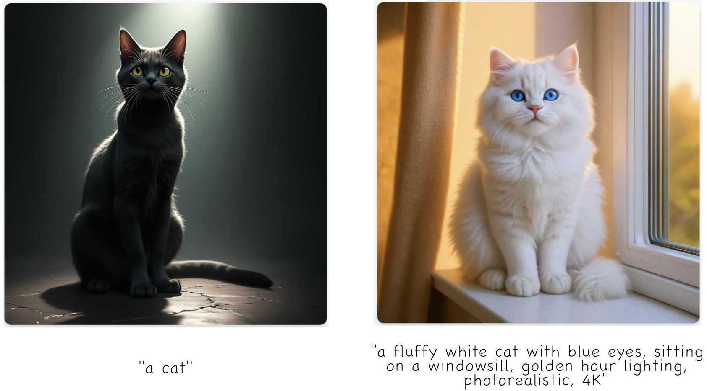
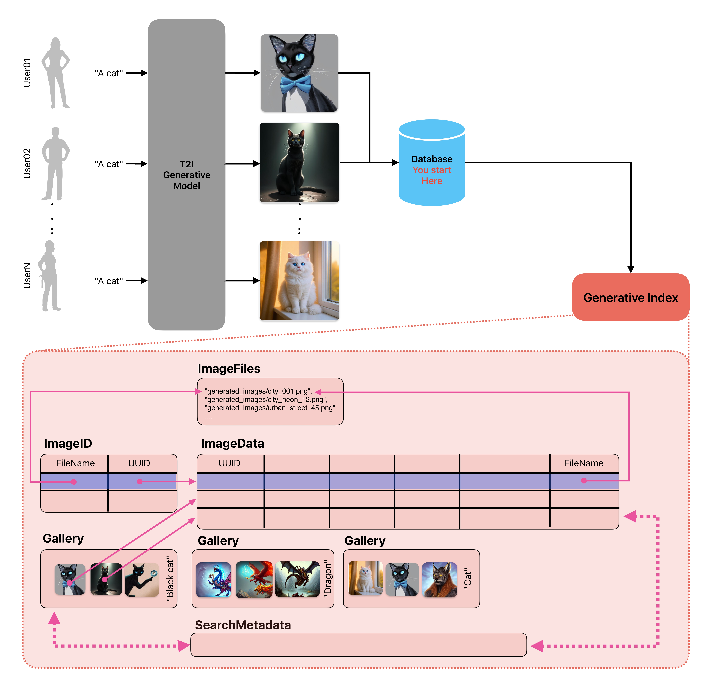

# Generative Index: Gestió d’Imatges Generades a Gran Escala 
# Guia de la Pràctica

# 1. Introducció

## 1.1 Context: Intel·ligència Artificial Generativa

Segurament ja heu utilitzat eines com ChatGPT, DALL-E, Midjourney o Stable Diffusion per generar imatges a partir de descripcions textuals. Aquestes eines formen part del que s'anomena Intel·ligència Artificial Generativa (Generative AI), una branca de la IA que es dedica a crear contingut nou —ja siguin imatges, text, àudio o vídeo— a partir de descripcions o paràmetres proporcionats per l'usuari.

Els models generatius d'imatges més populars actualment funcionen transformant una descripció textual —anomenada **prompt**— en una imatge visual. Per exemple, el prompt "a futuristic city at sunset, digital art, highly detailed" podria generar una imatge d'una ciutat futurista amb colors càlids i estil artístic digital.

### El problema de gestionar col·leccions massives

Amb l'auge d'aquestes eines, cada vegada més usuaris i organitzacions generen milers o milions d'imatges amb IA. Això planteja nous reptes:

- Com organitzar i cercar dins col·leccions enormes d'imatges generades?
- Com trobar imatges similars quan no hi ha metadades tradicionals com autor o data?
- Com recomanar paràmetres o termes per generar imatges amb característiques específiques?

Aquest és el context on s'emmarca aquesta pràctica: construir un sistema eficient per gestionar col·leccions d'imatges generades per IA.

### Què és el Prompt Engineering?

El prompt engineering (enginyeria de prompts) és la disciplina que estudia com escriure descripcions efectives per obtenir els millors resultats d'un model generatiu. No tots els prompts són iguals:

- **Prompt bàsic:** "a cat" → Resultats genèrics i poc controlats
- **Prompt elaborat:** "a fluffy white cat with blue eyes, sitting on a windowsill, golden hour lighting, photorealistic, 4K" → Resultats molt més específics i de qualitat



Els prompts efectius solen incloure:

- Descripció del subjecte principal ("a dragon")
- Estil artístic ("digital art", "oil painting", "photorealistic")
- Detalls tècnics ("volumetric lighting", "highly detailed", "4K")
- Composició ("centered", "close-up", "wide angle")

En aquesta pràctica, una de les funcionalitats més avançades serà precisament analitzar col·leccions d'imatges per recomanar termes útils per a prompts, basant-se en la similitud semàntica entre imatges.

## 1.2 Objectius de la pràctica

Aquesta pràctica es pot catalogar dintre del conjunt d'aplicatius anomenats **Gestors de Col·leccions d'Imatges** o Image Collection Managers. Aquestes aplicacions tenen com a objectiu principal emmagatzemar i gestionar les col·leccions d'imatges dels usuaris, proporcionant determinades funcionalitats auxiliars com ara la creació de galeries i recomanacions d'imatges similars basades en el seu contingut semàntic.

Les funcionalitats principals que implementareu són:

- **Recuperació de metadades** embegudes dins les imatges PNG (prompt, model, paràmetres de generació, etc.)
- **Gestió de galeries** d'imatges d'una determinada col·lecció
- **Visualització** de les imatges 
- **Cerca i filtrat** basat en paràmetres de generació
- **Recomanacions** basades en similitud semàntica mitjançant anàlisi de prompts
- **Generació de stats** sobre la col·lecció (models més usats, prompts populars, etc.)

Dintre d'aquest domini, la pràctica desenvolupada haurà de realitzar amb la suficient eficiència les tasques que s'aniran descrivint, mostrant així la utilitat de fer servir estructures de dades complexes per augmentar el rendiment del processament de dades.

## 1.3 Base de dades d'imatges

En aquesta pràctica utilitzarem imatges provinents del dataset [DiffusionDB](https://github.com/poloclub/diffusiondb), un conjunt massiu de 14 milions d'imatges generades per usuaris reals utilitzant el model Stable Diffusion. DiffusionDB és el primer dataset públic a gran escala de prompts text-to-image, i conté tant les imatges generades com tots els paràmetres utilitzats per crear-les.

Per a la pràctica, utilitzarem un subconjunt reduït d'aquest dataset (1000 imatges seleccionades), suficient per demostrar les funcionalitats del gestor sense requerir descarregar terabytes de dades.

### 1.3.1 Metadades embegudes en PNG

**Important:** A diferència dels datasets originals que emmagatzemen metadades en fitxers JSON separats, en aquesta pràctica les metadades estan **embegudes directament dins dels fitxers PNG** utilitzant el sistema de *text chunks* del format PNG. Això simplifica la gestió i fa més realista l’escenari d’ús —similar a com EXIF funciona en fotografies.

> 💡 **Context real:** En plataformes de generació d’imatges amb IA, com ara Stable Diffusion o Midjourney, les metadades no s’afegeixen manualment després de la generació. En entorns reals, aquestes metadades són **automàticament embegudes en el moment en què la imatge és generada**, com a part del procés de renderització. Això permet que cada imatge porti incorporada la informació essencial del seu origen (prompt, model, paràmetres, etc.), facilitant la seva gestió posterior.


Cada imatge PNG conté les següents metadades embegudes:

| Camp | Nom en PNG | Tipus | Descripció |
|------|------------|-------|------------|
| `Prompt` | string | Descripció textual utilitzada per generar la imatge |
| `Seed` | string | Llavor aleatòria per a la generació (mateixa seed + mateix prompt = mateixa imatge) |
| `CFG_Scale` | string | Guidance scale: controla quant de "literal" és el model amb el prompt (típicament 7-12) |
| `Steps` | string | Nombre de passos d'iteració del model (típicament 20-100) |
| `Sampler` | string | Algorisme de mostreig utilitzat (p.ex., `"k_lms"`, `"k_euler"`, `"ddim"`) |
| `Model` | string | Model utilitzat (p.ex., `"SD2"`, `"SD3.5"`, `"Midjourney"`, `"Dalle2"`, `"Flux"`, `"SD1.5"`) |
| `Generated` | string | Sempre `"true"` per indicar que és una imatge generada |
| `Created_Date` | string | Data de creació en format YYYY-MM-DD |

**Nota:** Tots els camps es guarden com a string dins del PNG, però podeu convertir-los als tipus apropiats (int, float) quan els llegiu.

### 1.3.2 Estructura de fitxers

La col·lecció d'imatges segueix una estructura simple:

```bash
./
├── generated_images/          # Directori principal d'imatges
│   ├── 3bfcd9cf-26ea-4303-bbe1-b095853f5360.png
│   ├── 5f47c66c-51d4-4f2c-a872-a68518f44adb.png
│   ├── 66b428b9-55dc-4907-b116-55aaa887de30.png
│   ├── [...]                  # Centenars d'imatges més
│   └── fd2a8b9e-1234-5678-9abc-def012345678.png
└── cfg.py                     # Configuració del projecte
```

Cada imatge té un nom únic generat amb UUID Version 4, garantint que no hi hagi col·lisions de noms.

### 1.3.3 Galeries d'imatges

Les galeries són col·leccions organitzades d'imatges que comparteixen alguna característica comuna (mateix estil, mateix tema, mateixa època, etc.). Són l'equivalent a les llistes de reproducció per música o vídeo.

Les galeries s'emmagatzemaran en format JSON, amb una estructura simple:

```json
{
  "gallery_name": "Cyberpunk Cities",
  "description": "Collection of futuristic urban landscapes",
  "created_date": "2024-10-02",
  "images": [
    "generated_images/city_001.png",
    "generated_images/city_neon_12.png",
    "generated_images/urban_street_45.png"
  ]
}
```

---

# 2. Codi d'exemple

## 2.1 Configuració del projecte

El fitxer `cfg.py` conté la configuració principal del projecte:

```python
# -*- coding: utf-8 -*-
"""
cfg.py : Dades de configuració de la pràctica i funcions auxiliars
Adaptat per a gestió d'imatges generades amb IA
"""

import platform
import sys
import os
import os.path
import uuid

# Selecció del vostre PATH amb les imatges generades
ROOT_DIR = r"generated_images"                      # Directori local

# Imatge per defecte per a fer proves
IMAGE_DEFAULT = "42be33f4-a5c4-488a-80c1-5d10c713e0dc.png"

# Mode de visualització
DISPLAY_MODE = 1  # 0: només metadades, 1: metadades + imatge, 2: només imatge

def get_root() -> str:
    """Retorna el local pathname complet de la col·lecció d'imatges."""
    return os.path.realpath(ROOT_DIR)

def get_uuid(filename: str = "") -> str:
    """Retorna el UUID d'un path."""
    return uuid.uuid5(uuid.NAMESPACE_URL, filename)

def get_canonical_pathfile(filename: str) -> str:
    """Retorna el pathname relatiu amb un format universal."""
    file = os.path.normpath(filename)
    file = os.path.relpath(file, ROOT_DIR)
    file = file.replace(os.sep, '/')
    return file

def get_one_file(mode: int = 0) -> str:
    """Retorna el local pathname complet d'una imatge de la col·lecció."""
    """Funció d'exemple, no utilitzar a la pràctica directament!"""
    file = os.path.realpath(os.path.join(ROOT_DIR, IMAGE_DEFAULT))
    if mode != 1:
        for root, dirs, files in os.walk(ROOT_DIR):
            for filename in files:
                if filename.lower().endswith(tuple(['.png', '.jpg', '.jpeg'])):
                    file = os.path.join(root, filename)
                    break
    return file
```

## 2.2 Script de proves per llegir metadades

Aquí teniu un exemple complet de com llegir les metadades embegudes en imatges PNG:

```python
# -*- coding: utf-8 -*-
"""
test-images.py : Script de proves per visualitzar imatges generades amb IA
"""

import cfg      # Necessari per a la pràctica !!
                # Mireu el contingut de l'arxiu

import os.path
import sys
from PIL import Image      # $ pip install pillow

# STEP 1: Cerca de les imatges al filesystem
print("Cercant imatges dins [" + cfg.get_root() + "]\n")
uri_file = cfg.get_one_file(0)  # Aquesta funció és només de proves!

if not os.path.isfile(uri_file):
    print("ERROR: Imatge inexistent!")
    sys.exit(1)

# STEP 2: Obtenció de les metadades embegudes
try:
    img = Image.open(uri_file)
    metadata = img.text if hasattr(img, 'text') else {}
except Exception as e:
    print(f"ERROR: No es pot llegir la imatge: {e}")
    sys.exit(1)

print("Metadades trobades:")
print(metadata)
print('')

if not metadata:
    print("WARNING: Imatge sense metadades generades!")

# Extracció de metadades específiques d'IA generada
try:
    prompt = metadata.get('Prompt', 'None')
except:
    prompt = "None"

try:
    seed = metadata.get('Seed', 'None')
except:
    seed = "None"

try:
    cfg_scale = metadata.get('CFG_Scale', 'None')
except:
    cfg_scale = "None"

try:
    steps = metadata.get('Steps', 'None')
except:
    steps = "None"

try:
    sampler = metadata.get('Sampler', 'None')
except:
    sampler = "None"

try:
    model = metadata.get('Model', 'None')
except:
    model = "None"

try:
    generated = metadata.get('Generated', 'None')
except:
    generated = "None"

try:
    created_date = metadata.get('Created_Date', 'None')
except:
    created_date = "None"

# STEP 3: Generació del identificador únic (compatible amb l'original)
name_file = cfg.get_canonical_pathfile(uri_file)
image_uuid = cfg.get_uuid(name_file)

# STEP 4: Visualització
if (cfg.DISPLAY_MODE < 2):
    print("Visualitzant [{}]".format(uri_file))
    print(" Prompt:     {}".format(prompt[:100] + "..." if len(prompt) > 100 else prompt))
    print(" Model:      {}".format(model))
    print(" Seed:       {}".format(seed))
    print(" CFG Scale:  {}".format(cfg_scale))
    print(" Steps:      {}".format(steps))
    print(" Sampler:    {}".format(sampler))
    print(" Generated:  {}".format(generated))
    print(" Created:    {}".format(created_date))
    print(" UUID (calc):{}".format(image_uuid))
    print(" Arxiu:      {}".format(name_file))

if (cfg.DISPLAY_MODE > 0):
    # Mostrar la imatge (simple display)
    print("\nMostrant imatge...")

    try:
        # Simple display using PIL
        img.show()
        print("Imatge mostrada. Premi Enter per continuar...")
        input()
    except Exception as e:
        print(f"No es pot mostrar la imatge: {e}")
        print("Potser necessiteu instal·lar un visualitzador d'imatges.")

# END
print("\nFinal!")
```

---

# 3. Primer lliurament (de 2)

## 3.1 Objectius

L’objectiu de la primera part de la pràctica és construir l’esquelet de l’aplicació. Dintre d’aquest esquelet hi haurà una implementació simple d’algunes de les funcionalitats demanades. Codi d'exemple es vol aconseguir:

- Familiaritzar-se amb l’entorn de les llibreries i els formats dels arxius utilitzats.
- Tenir-ne una representació a la memòria de les dades d’una imatge generada.

A partir d’aquí definim una sèrie de funcionalitats que cal implementar:

- **Func1:** `/* llistat d’imatges PNG */`
- **Func2:** `/* generar ID d’imatges */`
- **Func3:** `/* consultar metadades imatges */`
- **Func4:** `/* visualitzar imatges amb metadades */`
- **Func5:** `/* visualitzar galeries JSON */`
- **Func6:** `/* cercar imatges segons certs criteris */`
- **Func7:** `/* generar galeria basada en una cerca */`

### 3.1.1. Func1 `/* llistat d'imatges PNG */`

Aquesta funcionalitat implica obtenir una llista completa de tots els arxius PNG presents dins la col·lecció d'imatges. Això vol dir recórrer tots els subdirectoris a partir de `ROOT_DIR` per a obtenir la llista de tots els PNG existents al filesystem. Cal tenir-ne en compte que aquesta funció es podrà cridar en qualsevol moment per a obtenir una llista «actualitzada» dels arxius presents a la col·lecció.

Tingueu present a més que, internament i dins el codi de la pràctica, el que representa un arxiu és el **path relatiu** a on es troba dins el filesystem. Per tant, un arxiu queda identificat pel nom de l'arxiu i els subdirectoris des del `ROOT_DIR` que el contenen. D'aquesta forma un exemple d'arxiu amb path relatiu hi seria `"subdir1/cyberpunk/city_001.png"`; i aquest seria diferent de l'arxiu `"subdir2/city_001.png"`, encara que l'arxiu físic fos una còpia idèntica amb les mateixes metadades.

Per a implementar aquesta funcionalitat hi caldrà crear una classe anomenada `ImageFiles`. Aquesta classe en una primera fase haurà d'implementar aquests mètodes:

- `ImageFiles.reload_fs(path: str)`
- `ImageFiles.files_added() -> list`
- `ImageFiles.files_removed() -> list`

Respecte a aquests mètodes, fixeu-vos que la funció `ImageFiles.reload_fs()` s'encarrega de mantenir a memòria una representació dels arxius que hi han al disc. Per tant, els mètodes `ImageFiles.files_added()` i `ImageFiles.files_removed()` faran referència només als canvis des de la darrera vegada que s'ha cridat al mètode que llegeix el disc.

També fixeu-vos que aquesta classe sempre treballarà amb Strings que representen directoris o arxius: i per tant les llistes que hi retornaran els mètodes seran llistes de Strings.

### 3.1.2. Func2 `/* generar ID d'imatges */`

Dintre del programa per a cada arxiu PNG es generarà un identificador únic d'imatge. Aquest identificador seguirà el format estàndard UUID o GUID de 128 bits. Això vol dir que per a identificar arxius d'imatge no hi farem servir el path de l'arxiu, sinó un altre valor més compacte. L'avantatge és que podrem fer servir un identificador de mida fixa envers de l'adreça al disc de l'arxiu. Per a fer això disposarem d'una funció que generarà a partir del path canònic de l'arxiu un valor únic, el qual serà l'ID de la imatge. Un exemple d'aquest UUID seria el següent String `"e2960755-c2b7-56bc-b0b1-5d206e899647"`.

Ara bé, cal tenir-ne en compte que aquesta funció, encara que té una probabilitat extremadament baixa, podria generar una col·lisió retornant el mateix identificador a partir de dos arxius diferents. Aquest cas extrem aquí no el tindrem en compte (suposarem que els UUID són realment únics dins el nostre sistema), però sí que haureu de comprovar que efectivament l'identificador és lliure quan es generi un de nou. En el cas de que no fos així i ja estigui utilitzat, el que caldrà fer és no tenir-ne en compte el nou arxiu trobat. És a dir, que el segon arxiu seria com si no hi fos. Caldrà però avisar d'aquest fet traient un missatge per pantalla que indiqui que aquest arxiu no s'utilitzarà, i continuar després amb l'execució de forma habitual.

Per a implementar aquesta funcionalitat hi caldrà crear una classe anomenada `ImageID`. Aquesta classe en una primera fase haurà d'implementar aquests mètodes:

- `ImageID.generate_uuid(file: str) -> str`
- `ImageID.get_uuid(file: str) -> str`
- `ImageID.remove_uuid(uuid: str)`

Fixeu-vos que aquesta classe també utilitzarà Strings per a representar els identificadors UUID. I que internament haurà de guardar els identificadors utilitzats. Per tant, només el mètode `ImageID.generate_uuid()` haurà de comprovar que l'identificador no està essent utilitzat. Així una vegada un UUID ha estat generat una vegada, només es podria tornar a utilitzar si s'ha cridat a `ImageID.remove_uuid()`. Finalment, el mètode `ImageID.get_uuid()` retornarà el valor del UUID sense cap més comprovació que veure si ha estat generat i és actiu (és a dir, que no hi ha estat esborrat).

### 3.1.3. Func3 `/* consultar metadades imatges */`

Donat un arxiu PNG qualsevol (de fet, donat el path relatiu de l'arxiu), cal poder llegir aquest arxiu i consultar les seves metadades embegudes. Aquestes metadades podran existir o no, i per tant, caldrà utilitzar alguna convenció predeterminada quan un camp no hi estigui definit. Així doncs, internament les metadades es representaran a la pràctica sempre per Strings, i el valor `"None"` indicarà que el camp està buit. 

La llista de metadades que obligatòriament heu de considerar són: **prompt, seed, cfg_scale, steps, sampler, model, generated, created_date**. Tot seguint l'exemple del codi descrit a la secció 2.2 d'aquest document. Tingueu present que aquestes metadades estan embegudes directament dins els fitxers PNG utilitzant el sistema de *text chunks*, a diferència d'altres formats que utilitzen fitxers separats.

A més de les metadades caldrà guardar també de cada imatge el path de l'arxiu. Això vol dir que si utilitzem com a identificador el UUID de l'arxiu, llavors serà necessari emmagatzemar també no només els camps de les metadades, sinó també el path de l'arxiu físic original. D'aquesta forma hi serà possible obtenir l'adreça de l'arxiu al disc a partir de l'identificador únic d'imatge que s'utilitza dins el codi de la pràctica.

Com podeu veure, existeix doncs una relació 1:1 entre els arxius i les imatges. Els arxius hi queden identificats pels paths relatius, i les imatges pels identificadors UUID.

Per a implementar aquesta funcionalitat hi caldrà crear una classe anomenada `ImageData`. Aquesta classe en una primera fase haurà d'implementar aquests mètodes:

- `ImageData.add_image(uuid: str, file: str)`
- `ImageData.remove_image(uuid: str)`
- `ImageData.load_metadata(uuid: str)`
- `ImageData.get_prompt(uuid: str) -> str`
- `ImageData.get_model(uuid: str) -> str`
- `ImageData.get_seed(uuid: str) -> str`
- `ImageData.get_cfg_scale(uuid: str) -> str`
- `ImageData.get_steps(uuid: str) -> str`
- `ImageData.get_sampler(uuid: str) -> str`
- `ImageData.get_generated(uuid: str) -> str`
- `ImageData.get_created_date(uuid: str) -> str`


És important tenir-ne en compte que el mètode `ImageData.add_image()` només crea l'entrada per la imatge en qüestió, sense afegir els camps de metadades (però sí que guarda el path de l'arxiu). Per tant, inicialment totes les metadades estaran buides fins que es crida al mètode `ImageData.load_metadata()`. A més, s'ha de tenir present que aquest mètode es podria cridar múltiples vegades, especialment si l'arxiu s'ha modificat.


### 3.1.4. Func4 `/* visualitzar imatges amb metadades */`

Per a visualitzar una imatge hi han dues accions que resulten necessàries. La primera és imprimir per pantalla les metadades, i la segona és cridar a un visualitzador per a mostrar la imatge. Dins la pràctica, la primera acció es farà consultant les metadades ja presents dins la memòria. Mentre que la segona es farà passant al visualitzador l'adreça de l'arxiu PNG. La raó de fer aquesta dicotomia és que el procés de llegir les metadades des de l'arxiu és redundant, i per tant resulta més òptim fer-ho així. En conseqüència l'acció de visualitzar utilitzarà com a paràmetre el path de l'arxiu, i l'acció d'imprimir les metadades utilitzarà l'id de la imatge.

Aquestes dues accions hi seran per tant independents. Però també caldrà una funció que pugui ajuntar-les de tal forma que es facin alhora. A més, artificialment definirem que aquesta funció es pugui configurar permetent així que es pugui sel·leccionar quines accions s'executaran realment. Això es farà utilitzant el paràmetre definit a la configuració per aquesta tasca: `cfg.DISPLAY_MODE`. La raó d'això serà poder comprovar l'execució de la pràctica dins un test de proves sense haver de visualitzar sempre les imatges.

Per a implementar aquesta funcionalitat hi caldrà crear una classe anomenada `ImageViewer`. Aquesta classe en una primera fase haurà d'implementar aquests mètodes:

- `ImageViewer.print_image(uuid: str)`
- `ImageViewer.show_file(file: str)`
- `ImageViewer.show_image(uuid: str, mode: int)`

Cal tenir present que `ImageViewer.show_file()` utilitzarà la llibreria PIL/Pillow per mostrar la imatge (amb el mètode `Image.show()`), que obre la imatge en el visualitzador per defecte del sistema operatiu. El mètode `ImageViewer.show_image()` combinarà la impressió de metadades i la visualització segons el valor del paràmetre `mode` (0: només metadades, 1: metadades + imatge, 2: només imatge).

### 3.1.5. Func5 `/* visualitzar galeries JSON */`

Una galeria d’imatges és una col·lecció organitzada d’arxius PNG que comparteixen alguna característica comuna (mateix estil, mateix tema, mateix model de generació, etc.). A diferència dels vídeos, les imatges no tenen una dimensió temporal, per tant no té sentit parlar de “llistes de reproducció”. En el context de les imatges generades per IA, el concepte de galeria és més natural i útil, ja que permet agrupar visualment i semànticament les imatges.

Aquesta funcionalitat implica poder llegir un fitxer JSON que conté la definició d’una galeria, validar que les imatges referenciades existeixen dins la col·lecció, i visualitzar-les en ordre. El format JSON és simple i conté informació com el nom de la galeria, una descripció, la data de creació i la llista d’imatges incloses.


Exemple de galeria en format JSON:

```json
{
  "gallery_name": "Cyberpunk Cities",
  "description": "Collection of futuristic urban landscapes",
  "created_date": "2025-09-30",
  "images": [
    "generated_images/city_001.png",
    "generated_images/city_neon_12.png",
    "generated_images/urban_street_45.png"
  ]
```

Per implementar aquesta funcionalitat caldrà crear una classe anomenada `Gallery`. Aquesta classe haurà d’implementar els mètodes:

- `Gallery.load_file(file: str)`
- `Gallery.show()`

Una segona acció a realitzar ha de ser que a partir d’una col·lecció d’imatges (és a dir, una llista amb identificadors UUID), es puguin visualitzar en ordre les imatges de la galeria (utilitzant el mètode ImageViewer.show_image()). En tot cas, és important veure que per a visualitzar una imatge que apareix dins una galeria cal primer obtenir el seu identificador (path o UUID), i que només llavors es podrà cridar al visualitzador per mostrar-la , doncs cal tenir-ne els UUID corresponents per poder utilitzar-las.

És important tenir en compte que cada galeria es considera un objecte independent, i per tant es poden gestionar múltiples galeries simultàniament. Les galeries poden ser creades manualment (editant un fitxer JSON) o generades automàticament a partir de cerques (vegeu Func7). Guardeu dins alguna estructura simple (un array/vector ó similar) les diferents galerias que pugueu anar creant.

### 3.1.6. Func6 `/* cercar imatges segons certs criteris */`

Una funcionalitat intrínseca d'un gestor de col·leccions d'imatges és poder establir cerques dins la biblioteca. Per tant, l'acció de retornar les imatges que compleixen determinats criteris de cerca és fonamental. Dins la pràctica, resultarà necessari implementar alguns mètodes per a poder fer cerques d'arxius, encara que siguin senzilles. Per exemple, retornar la llista de les imatges generades amb un determinat model, o les que contenen certa paraula al prompt, o que s'han creat en una determinada data, etc. 

Per a ser suficientment útil, i a la vegada no massa complex, es demana que com a mínim es puguin cercar subcadenes de text dins els camps de les metadades. És a dir, que cal comprovar la presència d'una cadena de text (substring) dins un String; i això ho podeu fer utilitzant les funcions bàsiques de la classe `str`, com ara `str.find()`. Per exemple, una cerca de `"cyberpunk"` dins el camp prompt hauria de retornar totes les imatges que continguin aquesta paraula en qualsevol part del seu prompt.

D'altra banda, també s'hauran de poder realitzar operacions lògiques bàsiques entre llistes de resultats. Així, per exemple, cal poder trobar imatges que compleixen diferents criteris simultàniament (operador AND), o imatges que compleixen almenys un dels criteris (operador OR). Respecte a això, només caldrà implementar els operadors AND i OR de les llistes retornades.

Per a implementar aquesta funcionalitat hi caldrà crear una classe anomenada `SearchMetadata`. Aquesta classe en una primera fase haurà d'implementar aquests mètodes:

- `SearchMetadata.prompt(sub: str) -> list`
- `SearchMetadata.model(sub: str) -> list`
- `SearchMetadata.seed(sub: str) -> list`
- `SearchMetadata.cfg_scale(sub: str) -> list`
- `SearchMetadata.steps(sub: str) -> list`
- `SearchMetadata.sampler(sub: str) -> list`
- `SearchMetadata.date(sub: str) -> list`
- `SearchMetadata.and_operator(list1: list, list2: list) -> list`
- `SearchMetadata.or_operator(list1: list, list2: list) -> list`

Cal prestar atenció a que les llistes retornades hi poden ser buides. I també, que els valors han de ser sempre identificadors d'imatges (UUID). Fixeu-vos també que aquestes "lists" no són en cap moment un objecte Gallery sinó llistes normals de Python.

### 3.1.7. Func7 `/* generar galeria basada en una cerca */`

Cal poder crear una galeria a partir d’una cerca. Això implica afegir i treure imatges d’una galeria de forma dinàmica.

Per implementar aquesta funcionalitat caldrà ampliar la classe `Gallery` amb els mètodes:

- `Gallery.add_image_at_end(uuid: str)`
- `Gallery.remove_first_image()`
- `Gallery.remove_last_image()`


## 3.2 Diagrama
Seguidament teniu un diagrama no formal que descriu els elements rellevants de la primera part de la pràctica per a que hi pugueu veure gràficament les relacions entre les diferents estructures de dades:



## 3.3 Lliurament

Per a fer el lliurament del projecte caldrà fer un upload dels fitxers de la vostra pràctica dins el Caronte. La llista dels arxius necessaris són (fixeu-vos que "cfg.py" no està inclòs):

- **p1_main.py**
- **ImageFiles.py ; ImageID.py ; ImageData.py ; Gallery.py ; SearchMetadata.py**
- **Docum.PDF**

El darrer document consisteix en omplir el següent template i generar un arxiu PDF amb les vostres respostes. Això servirà com a documentació bàsica del vostre treball.

| Documentació Projecte E.D. - Fase I |  |
|-------------------------------------|--|
| **Autors** | *Noms i NIUs* |
| **Qualificació "grade"** | *Valor obtingut amb l'execució del test de proves* |
| **Implementació utilitzada per a les estructures** | *Per a cada Classe implementada, explicar quines estructures de dades heu utilitzat internament* |
| **Cerques realitzades** | *Llista de les cerques de prova realitzades (per model, prompt, data, etc.)* |
| **Galeries creades** | *Descripció de les galeries de prova creades durant el desenvolupament* |
| **Anotacions** | *Expliqueu aquí qualsevol comentari rellevant respecte a la vostra implementació* |
| **Diagrama** | *Feu un diagrama explicant l'arquitectura de la vostra implementació* |

